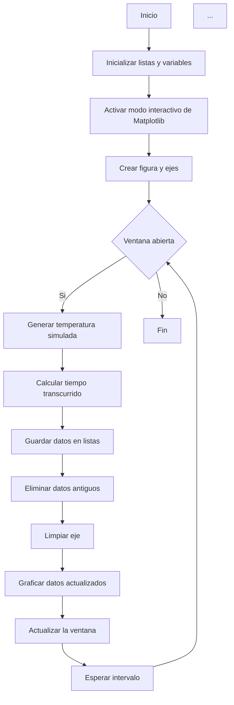

# Lab03: Visualización interactiva de datos en Raspberry Pi usando Python y Matplotlib

## Integrantes
- PABLO CESAR AREVALO POVEDA
- CARLOS ANDRES CASTILLO
- CRISTIAN CELY

## Documentación

### Objetivo de aprendizaje
Desarrollar un programa en Python que simule la lectura de un sensor y grafique los datos en tiempo real desde la Raspberry Pi Zero W, usando interfaz gráfica a través de VNC Viewer.

### Requisitos

#### Hardware
- Raspberry Pi con Raspberry Pi OS instalado.
- Conexión a red local (Wi‑Fi o Ethernet).
- Un computador con Windows, macOS o Linux.

#### Software
- Python 3 instalado en la Raspberry Pi.
- Matplotlib instalado en la Raspberry Pi.

Comando de instalación:
```bash
sudo apt update
sudo apt install python3-matplotlib -y
```

## Procedimiento

### Parte 1: Habilitar acceso gráfico con VNC

Para poder visualizar el entorno gráfico de la Raspberry Pi desde otro computador, se habilitó el servicio VNC.

#### Pasos realizados
1. En la terminal de la Raspberry Pi se ejecutó:
   ```bash
   sudo raspi-config
   ```
2. Se ingresó a:
   **Interface Options → VNC → Enable**
3. Se guardaron los cambios y se reinició la Raspberry Pi:
   ```bash
   sudo reboot
   ```
4. Una vez iniciada nuevamente, se obtuvo la dirección IP con:
   ```bash
   ifconfig
   ```
5. En el computador local se instaló **VNC Viewer**.
6. Se abrió VNC Viewer y se ingresó la IP de la Raspberry Pi.
7. Se ingresaron las credenciales de acceso.
8. Finalmente, se abrió el escritorio remoto de la Raspberry Pi.

### Evidencia del acceso remoto


### Parte 2: Código Python para graficar en tiempo real

Se instaló la biblioteca Matplotlib en la Raspberry Pi y se ejecutó el código proporcionado en el repositorio de GitHub Classroom.

El programa realiza las siguientes tareas:
- Lee la temperatura del sistema mediante un comando del sistema.
- Almacena los datos en listas.
- Grafica en tiempo real.
- Actualiza la gráfica sin bloquear la ejecución.

### Funcionalidades principales
- Uso de `subprocess.check_output(...)` para ejecutar comandos del sistema.
- Uso de `plt.ion()` para activar el modo interactivo de Matplotlib.
- Uso de `time.sleep()` para controlar el intervalo de lectura.
- Visualización dinámica de datos en una ventana gráfica.

## Diagrama de flujo



## Código del programa

```python
import matplotlib.pyplot as plt
import time
import random

class MonitorTemperaturaRPI:
    def __init__(self, duracion_max=60, intervalo=0.5):
        self.duracion_max = duracion_max
        self.intervalo = intervalo
        self.tiempos = []
        self.temperaturas_random = []
        self.inicio = time.time()

        plt.ion()
        self.fig, self.ax = plt.subplots()

    def leer_temperatura_random(self):
        return random.uniform(30, 50)

    def actualizar_datos(self):
        ahora = time.time() - self.inicio
        temp = self.leer_temperatura_random()

        self.tiempos.append(ahora)
        self.temperaturas_random.append(temp)

        while self.tiempos and self.tiempos < ahora - self.duracion_max:
            self.tiempos.pop(0)
            self.temperaturas_random.pop(0)

    def graficar(self):
        self.ax.clear()
        self.ax.plot(self.tiempos, self.temperaturas_random)
        self.ax.set_title("Temperatura Simulada CPU Raspberry Pi")
        self.ax.set_xlabel("Tiempo (s)")
        self.ax.set_ylabel("Temperatura (xBOC)")
        self.ax.grid(True)

        self.fig.canvas.draw()
        self.fig.canvas.flush_events()

    def ejecutar(self):
        try:
            while plt.fignum_exists(self.fig.number):
                self.actualizar_datos()
                self.graficar()
                time.sleep(self.intervalo)

        except KeyboardInterrupt:
            print("Monitoreo interrumpido por el usuario")

        finally:
            plt.ioff()
            plt.close(self.fig)

if __name__ == "__main__":
    monitor = MonitorTemperaturaRPI()
    monitor.ejecutar()
```

## Descripción del funcionamiento

El programa crea una clase llamada `MonitorTemperaturaRPI` que simula la lectura de temperatura de una Raspberry Pi usando valores aleatorios entre 30 y 50. Cada cierto intervalo de tiempo, el programa guarda el tiempo transcurrido y la temperatura generada, elimina datos antiguos si exceden la duración máxima y actualiza la gráfica en tiempo real.

La instrucción `plt.ion()` activa el modo interactivo de Matplotlib, lo que permite que la figura se actualice sin bloquear la ejecución. El ciclo principal permanece activo mientras la ventana esté abierta, y al cerrarse finaliza correctamente el programa. El bloque `try...except...finally` permite manejar la interrupción del usuario con `Ctrl+C` y cerrar la figura de forma ordenada.

## Preguntas desarrolladas

### 1. ¿Qué función cumple `plt.fignum_exists(self.fig.number)` en el ciclo principal?
Verifica si la ventana de la figura sigue abierta. Si el usuario cierra la ventana, el ciclo se detiene para evitar errores.

### 2. ¿Por qué se usa `time.sleep(self.intervalo)` y qué pasa si se quita?
Se usa para esperar entre cada lectura y controlar la frecuencia de actualización. Si se quita, el programa se ejecutará demasiado rápido y consumirá más recursos.

### 3. ¿Qué ventaja tiene usar `__init__` para inicializar listas y variables?
Permite configurar desde el inicio todos los atributos del objeto, evitando repetir código y asegurando que el programa tenga las variables necesarias listas para usar.

### 4. ¿Qué se está midiendo con `self.inicio = time.time()`?
Se guarda el instante inicial de ejecución para calcular cuánto tiempo ha pasado desde que comenzó el programa.

### 5. ¿Qué hace exactamente `subprocess.check_output(...)`?
Ejecuta un comando externo del sistema y devuelve su salida. En este laboratorio se usa para leer la temperatura real del CPU.

### 6. ¿Por qué se almacena `ahora = time.time() - self.inicio` en lugar del tiempo absoluto?
Porque así se obtiene el tiempo transcurrido desde el inicio del monitoreo, lo cual es más útil para graficar.

### 7. ¿Por qué se usa `self.ax.clear()` antes de graficar?
Para limpiar la gráfica anterior y redibujarla con los datos más recientes.

### 8. ¿Qué captura el bloque `try...except` dentro de `leer_temperatura()`?
Captura errores que puedan ocurrir durante la ejecución, como interrupciones del usuario o fallos en la lectura de datos.

### 9. ¿Cómo podría modificar el script para guardar las temperaturas en un archivo `.csv`?
Se puede usar el módulo `csv` de Python para escribir cada lectura en un archivo con columnas de tiempo y temperatura.

Ejemplo:
```python
import csv

with open("temperaturas.csv", "w", newline="") as archivo:
    escritor = csv.writer(archivo)
    escritor.writerow(["tiempo", "temperatura"])
    escritor.writerow([ahora, temp])
```

## Conclusión
Este programa permite comprender la visualización dinámica de datos en tiempo real con Python y Matplotlib. Además, muestra cómo estructurar un sistema de monitoreo usando clases, actualización periódica y control de la ventana gráfica.

## Explicación de las preguntas

### 1. ¿Qué función cumple `plt.fignum_exists(self.fig.number)` en el ciclo principal?
Verifica si la ventana de la figura sigue abierta. Si la figura fue cerrada por el usuario, el ciclo principal se detiene para evitar errores.

### 2. ¿Por qué se usa `time.sleep(self.intervalo)` y qué pasa si se quita?
Se usa para pausar entre lecturas y controlar la frecuencia de actualización. Si se quita, el programa ejecutaría las lecturas de manera muy rápida, consumiendo más recursos y dificultando la visualización.

### 3. ¿Qué ventaja tiene usar `__init__` para inicializar listas y variables?
Permite crear e inicializar los atributos del objeto desde el inicio, asegurando que todas las variables necesarias existan antes de ejecutar el programa.

### 4. ¿Qué se está midiendo con `self.inicio = time.time()`?
Se guarda el tiempo inicial de ejecución del programa para calcular el tiempo transcurrido en cada lectura.

### 5. ¿Qué hace exactamente `subprocess.check_output(...)`?
Ejecuta un comando externo del sistema operativo y devuelve su salida. En este laboratorio se usa para obtener la temperatura del CPU.

### 6. ¿Por qué se almacena `ahora = time.time() - self.inicio` en lugar del tiempo absoluto?
Porque así se obtiene el tiempo transcurrido desde el inicio del programa, lo cual es más útil para graficar la evolución de los datos.

### 7. ¿Por qué se usa `self.ax.clear()` antes de graficar?
Para limpiar la gráfica anterior y redibujarla con los datos actualizados.

### 8. ¿Qué captura el bloque `try...except` dentro de `leer_temperatura()`?
Captura errores que puedan ocurrir al leer o convertir la temperatura, evitando que el programa se cierre inesperadamente.

### 9. ¿Cómo podría modificar el script para guardar las temperaturas en un archivo `.csv`?
Se puede usar el módulo `csv` de Python para guardar cada lectura con su tiempo correspondiente.


```python
import csv

with open("temperaturas.csv", "w", newline="") as archivo:
    escritor = csv.writer(archivo)
    escritor.writerow(["tiempo", "temperatura"])
    escritor.writerow([tiempo, temperatura])
```

## Resultados obtenidos
Se logró visualizar en tiempo real la evolución de la temperatura desde la Raspberry Pi usando una interfaz gráfica remota por VNC Viewer. El programa permitió representar los datos de manera dinámica y comprender el comportamiento de la lectura periódica en Python.

## Conclusiones
Este laboratorio permitió reforzar el uso de VNC para acceder a la Raspberry Pi de forma remota y el uso de Python con Matplotlib para la visualización de datos en tiempo real. También se comprendió la importancia de estructurar correctamente el programa para actualizar la gráfica sin interrumpir la ejecución.

## Observaciones
- Es importante verificar que la Raspberry Pi esté conectada a la red antes de intentar acceder por VNC.
- Matplotlib debe estar instalado correctamente para que la gráfica funcione.
- El intervalo de lectura debe ajustarse para evitar sobrecarga en el sistema.